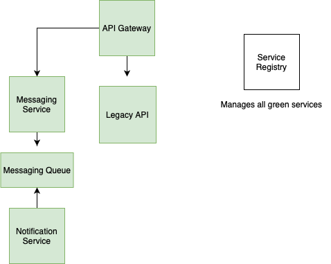
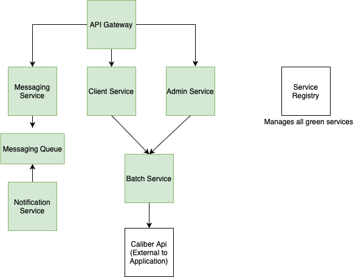

# Client Engagement Portal - Research Spike: Microservices
 
## Microservice Arguments
### Pro
- Scalability
- Maintainability
- Will work better for future iterations
- Asynchronous efficiency for messaging
- Easier to unit test
### Con
- Requires more infrastructure at a lower scale
- Significantly more complex
- Increased development and debugging time
- Project is currently well-suited to monolithic/SOA
 
# Conclusion
Over the last few days, our team has reviewed some of the advantages and disadvantages of migrating to a microservices architecture for the Client Engagement Portal, and given the project's current scale, we are not convinced this is a worthwhile change. The project is currently monolithic, and its performance doesn't appear to suffer from this. The number of users that the Client Engagement Portal serves is relatively small, as is the throughput of those users' HTTP requests and SQL queries. Additionally, there would only be a couple of services that could be extracted out of monolithic architecture, and extracting those services and making them microservices would cost comparatively more development time and infrastructure than if they were just left alone. In short, we believe this would be an overeager migration, and that the Client Engagement Portal's current scale and functions are more inline with a monolithic architecture. The added complexity of switching to microservices would outweigh the benefits gained.
 
# Recommendation for Future Iterations
In future iterations and as the application expands, we do recommend moving to microservices. During this migration, we suggest using the Strangler design pattern to incrementally convert the monolithic structure to microservices.
 
# Roadmap Architecture
Below is a suggested first step transition towards a microservices architecture. This includes migrating the messaging and notification services as they are ideal candidates to benefit from microvervices.

 
# Recommended Architecture
Below is what we imagine the microservices architecture would look like for the application in its current state. 

 
# References
- [Microservice Architecture Best Practices - Messaging Queues](https://www.springboottutorial.com/messaging-queues-and-asynchronous-communication-in-microservices)
- [Migration from Monolith to Microservices : Benchmarking a Case Study](https://www.researchgate.net/publication/339749917_Migration_from_Monolith_to_Microservices_Benchmarking_a_Case_Study)
- [Transitioning to Microservices: 3 Lessons From The Trenches](http://techgenix.com/transitioning-to-microservices/)
- https://www.castsoftware.com/blog/how-to-use-strangler-pattern-for-microservices-modernization)
- [Monolith to Microservices Using the Strangler Pattern](https://dzone.com/articles/monolith-to-microservices-using-the-strangler-patt)